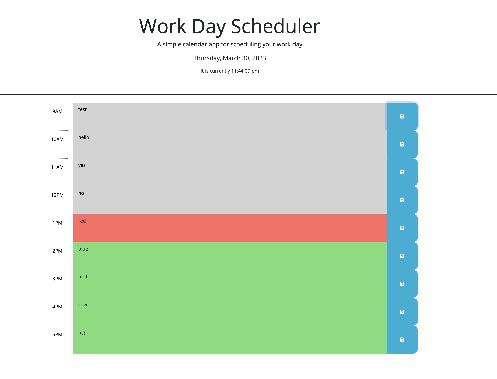

# work-day-scheduler

## Description

Provide a short description explaining the what, why, and how of your project. Use the following questions as a guide:

- What was your motivation?
- Why did you build this project? (Note: the answer is not "Because it was a homework assignment.")
- What problem does it solve?
- What did you learn?

## Table of Contents (Optional)

This is a web app in progress to keep track of daily commitments for a 9-5 schedule. It provides a current date at the top, as well as an clock to keep track of what time it is. It also adjusts the color of each hour block to help identify which hours have passed (grey), are current (red) or are in the future (green).

## Usage

To use this app, use the text field in each hour block to record commitments or activities. Use the save button to the right of each hour block to save that hours activities. When you refresh the page, the commitments you made should still be there. The following screenshot illustrates what the webpage may look like.

## Credits

I referred to [this stackoverflow](https://stackoverflow.com/questions/19635077/adding-objects-to-array-in-localstorage) webpage while trying to get localstorage to save in an array.

## License

Standard MIT License.
